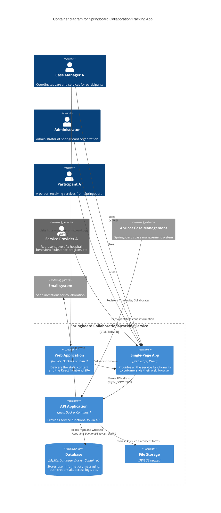

```mermaid
C4Container
    title Container diagram for Springboard Collaboration/Tracking App

    Person(persSB_CM, "Case Manager A", "Coordinates care and services for participants")
    Person(persSB_Admin, "Administrator", "Administrator of Springboard organization")
    Person(persSB_P, "Participant A", "A person receiving services from Springboard")
    Person_Ext(persExt_SvcA, "Service Provider A", "Representative of a hospital, <br>behavioral/substance program, etc")

    System_Ext(systemApricot, "Apricot Case Management", "Springboards case management system")
    System_Ext(systemEmail, "Email system", "Send invitations for collaboration")

    Container_Boundary(c1, "Springboard Collaboration/Tracking Service") {
        Container(web_app, "Web Application", "NGINX, Docker Container", "Delivers the static content <br>and the React front-end SPA")
        Container(spa, "Single-Page App", "JavaScript, React", "Provides all the service functionality <br>to cutomers via their web browser")
        Container(backend_api, "API Application", "Java, Docker Container", "Provides service functionality via API")
        ContainerDb(database, "Database", "MySQL Database, Docker Container", "Stores user information, messaging,<br>auth credentials, access logs, etc.")
        Container(files, "File Storage", "AWS S3 bucket")
    }
    Rel(persSB_CM, web_app, "Visits https://app.the-springboard.org/", "HTTPS")
    UpdateRelStyle(persSB_CM, web_app, $offsetY="60", $offsetX="-140")
    Rel(persSB_CM, spa, "Uses", "HTTPS")
    UpdateRelStyle(persSB_CM, spa, $offsetY="-1")

    Rel(web_app, spa, "Delivers to browser")
    UpdateRelStyle(web_app, spa, $offsetX="-50" $offsetY="-25")
    Rel(spa, backend_api, "Makes API calls to", "async, JSON/HTTPS")
    UpdateRelStyle(spa, backend_api, $offsetX="-50" $offsetY="-40")
    Rel_Back(database, backend_api, "Reads from and writes to", "sync, AWS DynamoDB Javascript API")
    UpdateRelStyle(database, backend_api, $offsetX="-50" $offsetY="-20")
    Rel(backend_api, files, "Stores files such as consent forms")
    UpdateRelStyle(backend_api, files, $offsetX="0" $offsetY="30")

    Rel(persSB_P, spa, "Uses")
    Rel(backend_api, systemEmail, "Sends invite")
    Rel(persExt_SvcA, spa, "Registers from invite, Collaborates")
    Rel(persSB_Admin, spa, "Uses")
    Rel(systemApricot, backend_api, "Participant/Milestone information")

    UpdateLayoutConfig($c4ShapeInRow="4", $c4BoundaryInRow="1")
```