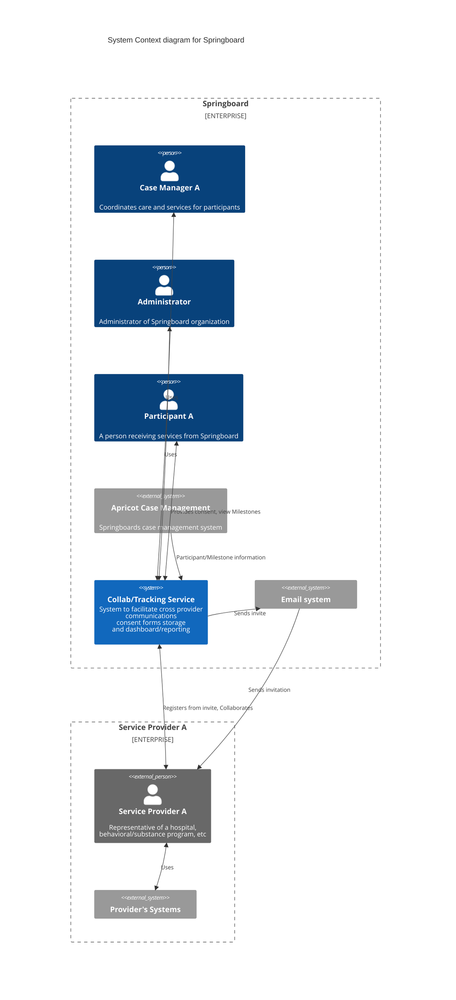

```mermaid
C4Context
    title System Context diagram for Springboard
    Enterprise_Boundary(b0, "Springboard") {
        Person(persSB_CM, "Case Manager A", "Coordinates care and services for participants")
        Person(persSB_Admin, "Administrator", "Administrator of Springboard organization")
        Person(persSB_P, "Participant A", "A person receiving services from Springboard")
        
        System_Ext(systemApricot, "Apricot Case Management", "Springboards case management system")
        System(systemSB, "Collab/Tracking Service", "System to facilitate cross provider<br>communications <br>consent forms storage<br>and dashboard/reporting")
        System_Ext(systemEmail, "Email system", "")
    }

    Enterprise_Boundary(bExtA, "Service Provider A") {
        Person_Ext(persExt_SvcA, "Service Provider A", "Representative of a hospital, <br>behavioral/substance program, etc")
        System_Ext(systemExtSvcProvA, "Provider's Systems")
    }

    BiRel(persSB_P, systemSB, "Provides consent, view Milestones")
    BiRel(persSB_CM, systemSB, "Uses")
    BiRel(persSB_Admin, systemSB, "Uses")
    Rel(systemSB, systemEmail, "Sends invite")
    Rel(systemApricot, systemSB, "Participant/Milestone information")

    BiRel(persExt_SvcA, systemSB, "Registers from invite, Collaborates")
    BiRel(persExt_SvcA, systemExtSvcProvA, "Uses")
    Rel(systemEmail, persExt_SvcA, "Sends invitation")

    UpdateLayoutConfig($c4ShapeInRow="3", $c4BoundaryInRow="1")
```